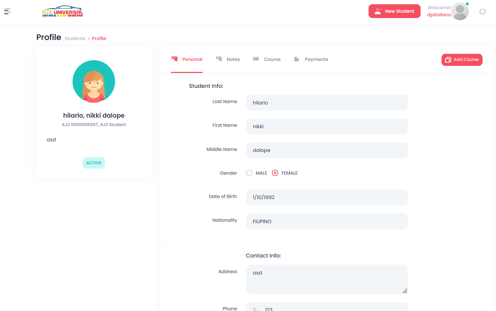
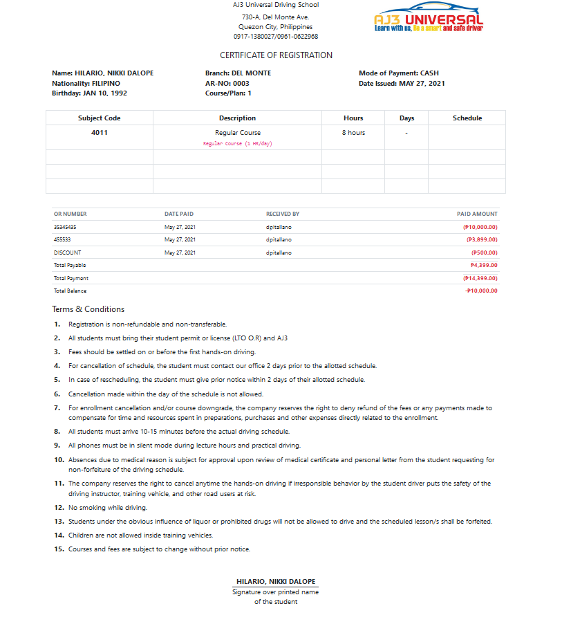

# Asp.Net Core Project

---

> AJ3 Universal Driving School Student Management System.

### Cloning

```shell
git clone https://github.com/DennisPitallano/DSSMS.git
```

## Requirements

- [Install](https://www.microsoft.com/net/download/windows#/current) the .NET 5 SDK or latest

### Running in Visual Studio

- Set Startup project:
  - AJ3.WebApp

## EF Core & Data Access

---

- The solution uses:
  
  - `ApplicationDbContext`: for Asp.Net Core Identity
  - `FluentValidation.AspNetCore` : for Model Validation rules

    - ```powershell
      Install-Package FluentValidation.AspNetCore -Version 10.3.6
      ```

- `AutoMapper`: for Object Mapping

    - ```powershell
      Install-Package AutoMapper.Extensions.Microsoft.DependencyInjection -Version 8.1.1
      ```

- `Microsoft.Data.SqlClient` : for Data Provider fro SQL Server

    - ```powershell
      Install-Package Microsoft.Data.SqlClient -Version 4.1.0
      ```

- `Dapper`: For ORM

    - ```powershell
      Install-Package Dapper -Version 2.0.78
      ```

## Run entity framework migrations:

> NOTE: Initial migrations are a part of the repository.

- .NET Core CLI
  
  - ```powershell
    dotnet ef database update
    ```

- Visual Studio
  
  - ```powershell
    Update-Database
    ```

> OR: you can just restore the **TPS.bak** to your SQL Server localhost

## Logging & App Setting

------

- We are using `Serilog` with pre-defined following Sinks - white are available in `appsettings.Logs.json`

- Initial App setting `appsettings.json`
  
  - ```json
    {
      "ConnectionStrings": {
        "SQLDBConnectionString": "Data Source=localhost;Initial Catalog=TPS;Integrated Security=True;Connect Timeout=30;Encrypt=False;TrustServerCertificate=False;ApplicationIntent=ReadWrite;MultiSubnetFailover=False"
      },
      "SystemSetUp": {
        "CompanyName": "AJ3 Universal Driving School",
        "Address": "730A Del Monte Ave. Talayan, Quezon City",
        "PhoneNumber": "",
        "MobileNumber": "+639",
        "Manager": "Manager",
        "TagLine": "Tag line"
      },
      "License": {
        "LicenseId": "123",
        "LicenseTo": "test"
      },
      "AllowedHosts": "*",
      "DbBackUp": {
        "Location": ""
      }
    }
    ```

## UI preview

------

- The application uses  [Metronic](https://preview.keenthemes.com/metronic8/demo18/index.html?_ga=2.129744394.783580045.1643866420-142488473.1634310666)

​    Login Page


  Student Master List


Student Profile

- Personal Info
- Course Notes
- Course Detail
- Payments History 
- Sample Certificate 

### VIDEO DEMO : http://somup.com/c3ne1QZmJV

### Suggestion

---

I am happy to share my attempt of the implementation of the ASP.NET Core.

Any feedback is welcome - feel free to create an issue or send me an email - [dpitallano@gmil.com](mailto:dpitallano@gmil.com). Thank you 😊